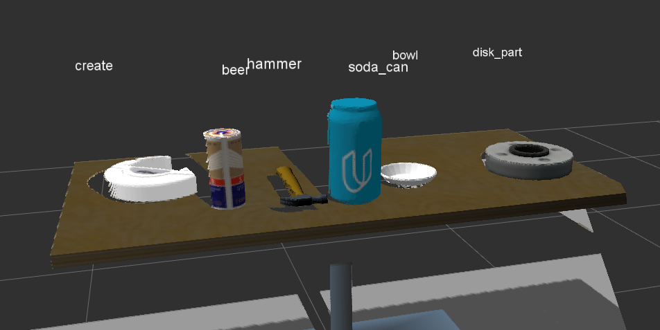

# RoboND-Perception-Exercises

This exercise shows how the robot "perceives" the environment and the steps taken calibrate, filter and segment

### What is a point cloud?

Point clouds are digital representations of three dimensional objects. In practical implementations, they can also contain additional metadata for each point, as well as a number of useful methods for operating on the point cloud.

Point Cloud Types:
* PointXYZ
* PointXYZI
* PointXYZRGB
* Normal
* PointNormal


## Point Cloud Filtering

This is the orginal image. The steps below shows how the image is filtered by first converting it to point cloud


### VoxelGrid Downsampling Filter

A voxel grid filter allows you to downsample the data by taking a spatial average of the points in the cloud confined by each voxel.

It takes in a parameter (leaf size) which determine the size of each voxel. Higher voxel is good as it is less data, but less details. Too high leaf size might cause missing information. Smaller size would cause high processing


### Passthrough Filter

The Pass Through Filter works much like a cropping tool, which allows you to crop any given 3D point cloud by specifying an axis with cut-off values along that axis. The region you allow to pass through, is often referred to as region of interest.

It takes in 3 parameters for the region of interest: axis, axis minimum, axis maximum


### RANSAC
RANSAC is an algorithm, that you can use to identify points in your dataset that belong to a particular model.

It returns the inliers and outliers based on the max_distance set

### ExtractIndices Filter
From the results of RANSAC, the inliers and outliers are extracted and calculated

##### Inliers


##### Outliers


### Outlier Removal Filter

One of the filtering techniques used to remove such outliers is to perform a statistical analysis in the neighborhood of each point, and remove those points which do not meet a certain criteria. PCL’s StatisticalOutlierRemoval filter is an example of one such filtering technique. For each point in the point cloud, it computes the distance to all of its neighbors, and then calculates a mean distance.

By assuming a Gaussian distribution, all points whose mean distances are outside of an interval defined by the global distances mean+standard deviation are considered to be outliers and removed from the point cloud.


## Point Cloud Segmentation and Clustering
Segmentation is the process of dividing point cloud data into meaningful subsets using some common property. Clustering is the process of finding similarities among individual points so they may be segmented

### Kmeans
Clustering by dividing the input data into a key number of clusters based on one or more features or properties


### Euclidean Clustering

Clustering where points that are closer to each other are clustered together by making use of a 3D grid subdivison of the space, 


## Object Recognition

### Feature
There are several ways to identify an object: color, position within the scene, shape, size

#### Color spaces
Most basic color representation is in RGB. However objects will have different color under a different lighting conditions in this representation (in RGB). Converting data to HSV (hue saturation value), allows it to be less sensative to different light conditions. 


```
# Define a function to compute color histogram features  
def color_hist(img, nbins=32, bins_range=(0, 256)):
    # Convert from RGB to HSV using cv2.cvtColor()
    hsv = cv2.cvtColor(img,cv2.COLOR_RGB2HSV)
    # Compute the histogram of the HSV channels separately
    r_hist = np.histogram(hsv[:,:,0], bins=32, range=(0, 256))
    g_hist = np.histogram(hsv[:,:,1], bins=32, range=(0, 256))
    b_hist = np.histogram(hsv[:,:,2], bins=32, range=(0, 256))
    # Concatenate the histograms into a single feature vector
    hist_features = np.concatenate((r_hist[0], g_hist[0], b_hist[0])).astype(np.float64)
    # Normalize the result
    norm_features = hist_features / np.sum(hist_features)
    # Return the feature vector
    return norm_features
```

#### Shape
Shapes are based on getting the surface normal historgrams

#### Classifications by features using SVM
Support Vector Machine or "SVM" is just a funny name for a particular supervised machine learning algorithm that allows you to characterize the parameter space of your dataset into discrete classes. 

SVMs work by applying an iterative method to a training dataset, where each item in the training set is characterized by a feature vector and a label. In the image above, each point is characterized by just two features, A and B. The color of each point corresponds to its label, or which class of object it represents in the dataset.

Applying an SVM to this training set allows you to characterize the entire parameter space into discrete classes. The divisions between classes in parameter space are known as "decision boundaries", shown here by the colored polygons overlaid on the data. Having created decision boundaries means that when you're considering a new object for which you have features but no label, you can immediately assign it to a specific class. In other words, once you have trained your SVM, you can use it for the task of object recognition!


## Overall steps from recording an image to identifying objects

1. Get input from ROS
2. ros to pcl
3. Voxel grid downsampling
4. PassThrough Filter
5. RANSAC Plane Segmentation
6. Extract inliers and outliers
7. Euclidean Clustering
8. Create Cluster-Mask Point Cloud to visualize each cluster separately
9. Classify the clusters! (loop through each detected cluster one at a time)
10. Grab the points for the cluster
11. Compute the associated feature vector
12. Make the prediction
13. Publish a label into RViz
14. Add the detected object to the list of detected objects.
15. Publish results


Based on the image above, a few things had to be updated to ensure it is correctly processing the image:
1. Ensure the cluster passing into the svm prediction algorithm includes the original features and not after euclidean (euclidean colors the blobs to separate)
2. Tweak bin size, the bin size has to be the same as the trained model, and when used for prediction
3. Using HSV is important (set to true) to ensure that the color insensitive to lighting. If hsv is used for prediction, same needs to be used for prediction
4. SVM can be tweaked to improve prediction performance

Doing the above results in:



